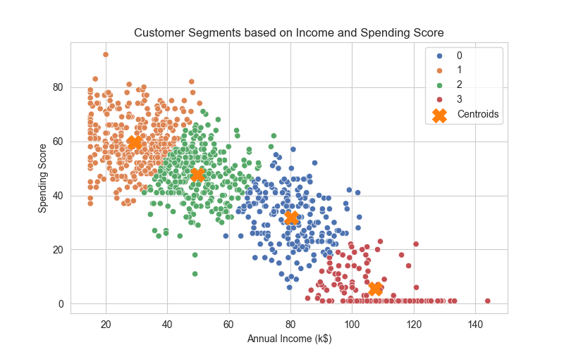
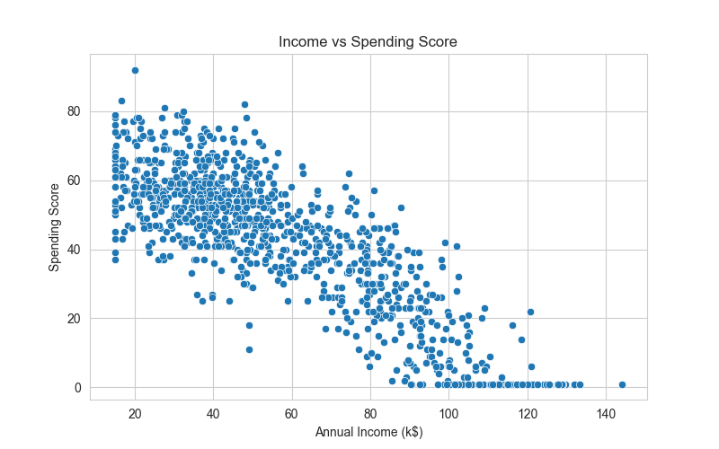
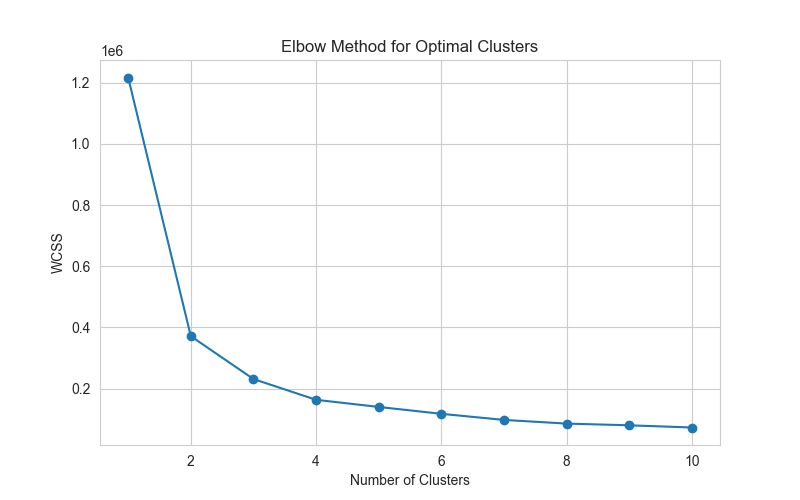
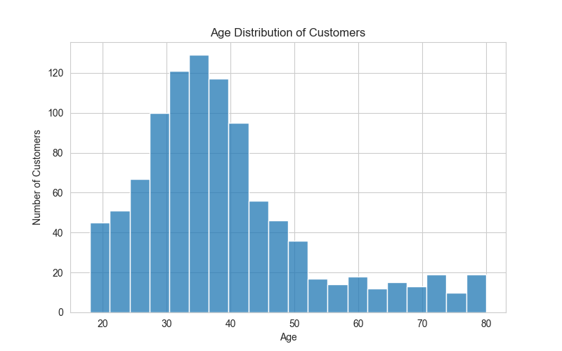
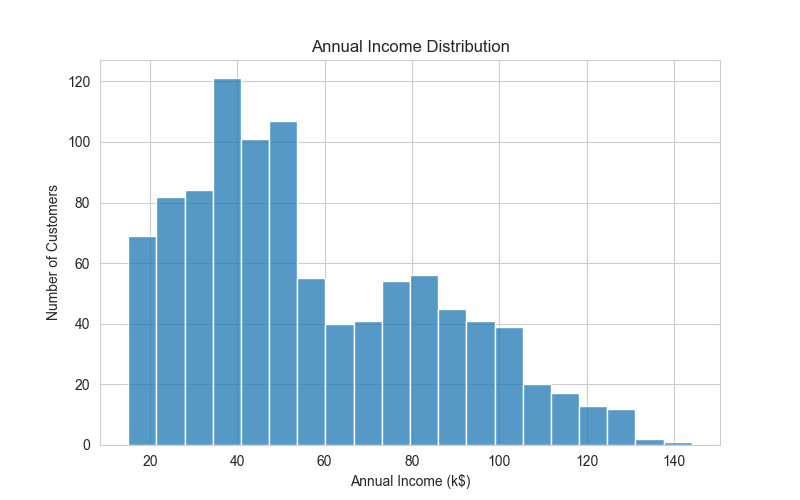
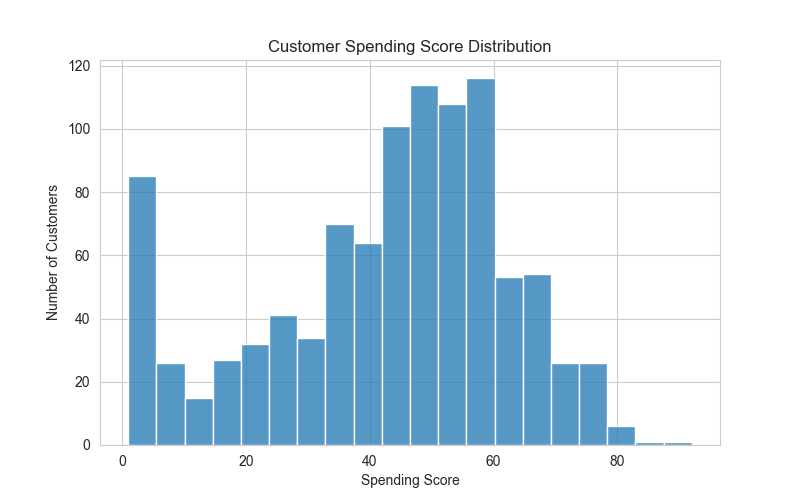
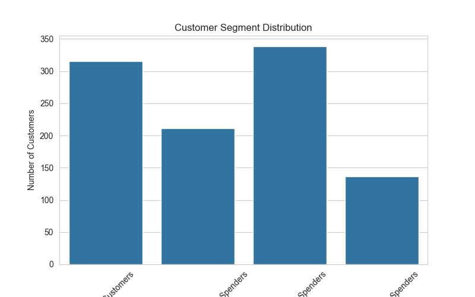
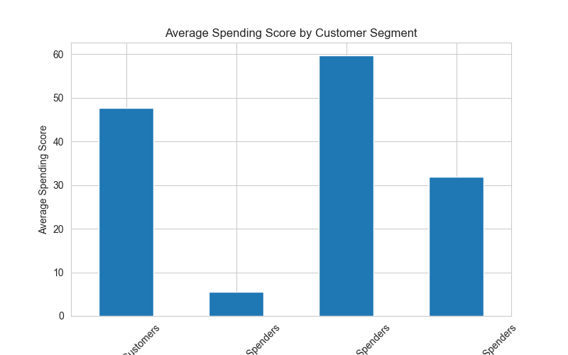

# Customer Segmentation Analysis

This project uses **machine learning (K-Means clustering)** to segment customers based on income and spending behavior in order to identify actionable business opportunities.

The goal is to help businesses understand different customer groups and optimize marketing strategies.

## Customer Segmentation Visualization

### Customer Segments (Income vs Spending)



This visualization shows how customers naturally group into different behavioral segments based on income and spending score.

## Key Analysis Visualizations

### Income vs Spending Relationship



Shows the relationship between customer income and their spending behavior.

### Elbow Method (Optimal Clusters)



The elbow method was used to determine the optimal number of clusters for K-Means segmentation.

### Customer Age Distribution



Understanding the demographic structure of customers helps businesses target marketing campaigns effectively.

### Income Distribution



Shows how customer income is distributed across the dataset.

### Spending Score Distribution



Illustrates how spending behavior varies across customers.

### Segment Distribution



Displays the number of customers belonging to each identified segment.

### Segment Spending Comparison



Compares average spending behavior across the identified segments.

## Tools Used

- Python
- Pandas
- NumPy
- Matplotlib
- Seaborn
- Scikit-learn
- Jupyter Notebook
- Git / GitHub

## Project Workflow

1. Data loading and inspection
2. Data cleaning
3. Exploratory data analysis
4. Feature selection
5. Data scaling
6. Elbow method for cluster optimization
7. K-Means clustering
8. Segment interpretation
9. Business insights extraction

## Dataset

Mall Customer Segmentation dataset containing:

- CustomerID
- Gender
- Age
- Annual Income
- Spending Score

## Customer Segments Identified

### High Value Customers
High income and high spending behavior.

**Business strategy**
- VIP programs
- Premium product offerings
- Personalized marketing

### Careful Spenders
High income but low spending behavior.

**Business strategy**
- Targeted promotions
- Upselling campaigns
- Loyalty incentives

### Budget Customers
Low income and low spending.

**Business strategy**
- Discounts
- Bundled offers
- Price-sensitive campaigns

### Impulse Buyers
Lower income but high spending.

**Business strategy**
- Flash sales
- Limited-time offers
- Social media promotions

## Key Business Insights

- High-income low-spending customers represent a **major untapped revenue opportunity**.
- Some customers spend aggressively despite lower income levels.
- Customer segmentation enables **targeted marketing strategies** instead of generic campaigns.

## Repository Structure

```text
customer-segmentation-analysis/
│
├── data/         # dataset used for analysis
├── notebooks/    # Jupyter notebook containing full analysis
├── visuals/      # charts generated during analysis
├── report/       # business insights report
├── README.md
└── requirements.txt